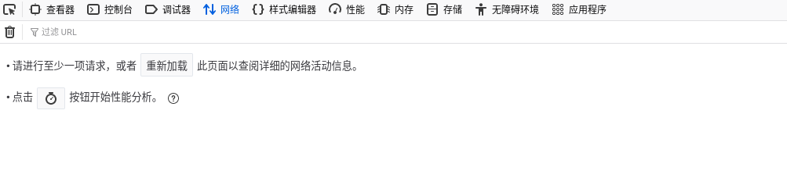
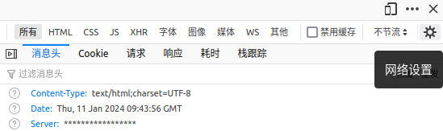
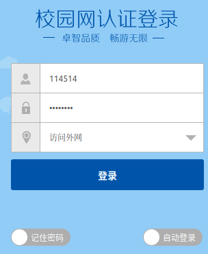
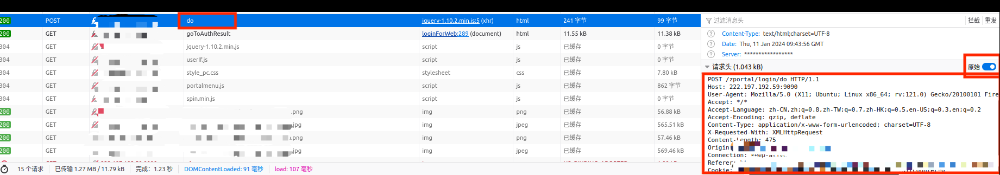
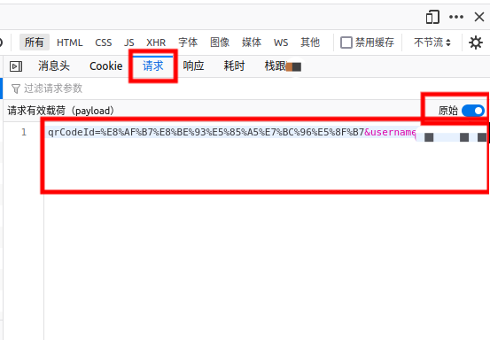

# XXUST-Web-Authenticate
某高校网络自动认证

## 使用方法

### 手动启动

使用浏览器打开认证页面


按 `F12`，打开 `网络` 选项卡。



弹出的界面右上角，点击网络设置（齿轮图标），勾选 `持续记录`。



输入用户名和密码，登录



选择文件为 `do` 的项目。

在 `消息头` 中的 `请求头` 栏中打开 `原始` 选项，复制全文，粘贴至 `headers.txt` 中。

把第二行 Host: 后面的内容和第一行 POST 后面的内容拼在一起，填入 `config.json` 中 `url` 字段。
例如图中所示的情况，`url` 字段应填入 `222.197.192.59:9090/zportal/login/do`。



选择 `请求` 栏 `表单数据`，同样打开 `原始` 选项，复制全文，粘贴至粘贴至 `config.json` 中 `data` 字段。



运行 `auto-auth.py`。

### 开机自动启动

#### Windows

将 `auto-auth.bat` 设为开机自启动即可。如果不行的话把里面的 `python` 替换成你使用的 python 解释器路径。

#### Linux

```bash
python register-service.py
```

## 配置文件

`config.json` 中包含程序配置。

`testInterval`：网络测试间隔；

`testIntervalRandRange`：网络测试间隔随机范围；

每次测试的间隔将在 $[testInterval-testIntervalRandRange, testInterval+testIntervalRandRange$ 范围内均匀随机取值。
